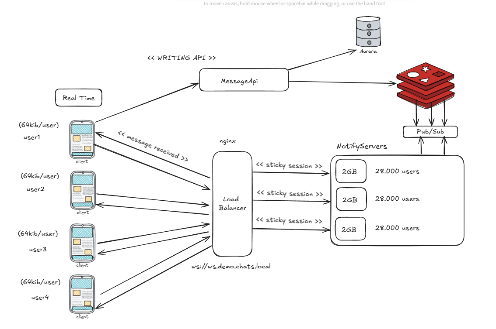
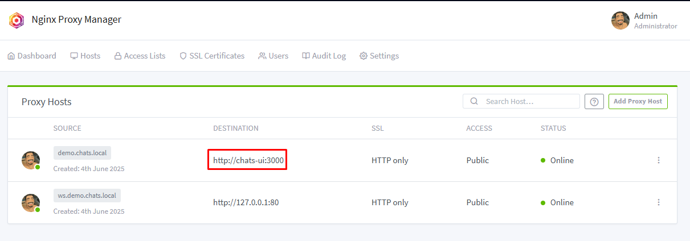
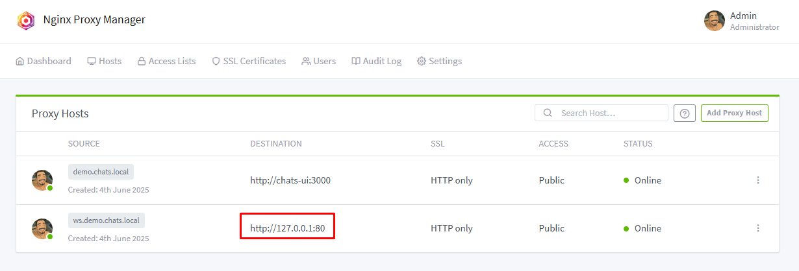
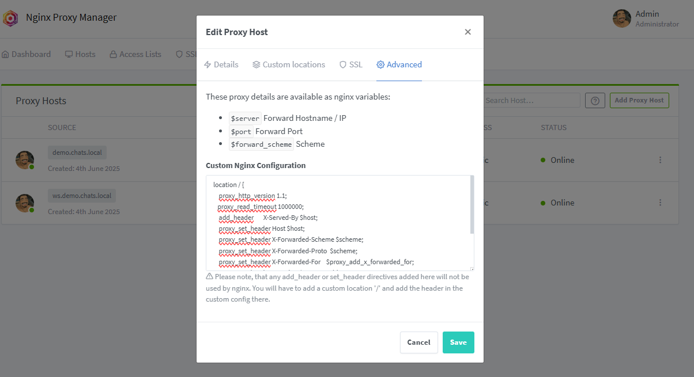

## Scalable Websocket chats demo

### Dependencies
- Nodejs v22.16.0 (I suggest to used nvm for ease of setup) https://github.com/nvm-sh/nvm
- pnpm
- Redis (For Pub/Sub)
- Nginx (For loadbalancing example) for ease of use i'm currently using nginx-proxy-manager to manage hosts and nginx files setup




### Running the project locally

1. Install dependencies

```bash
npm install -g pnpm@latest
pnpm install
```

2. Run the webclient
```bash
npm start
```

3. Run the socket-server
```bash
npm run start-socket
```

### Running the project locally with docker with load-balancing setup

For simplicity of using the demo locally simulating loadbalancing, we will be taking advantage of nginx and local dns hostnames lookup

1. Setup localhost hostnames for nginx virtual setup

1.1. WINDOWS: edit the hosts (C:\Windows\System32\drivers\etc\hosts) files to include the following lines
```bash
127.0.0.1 demo.chats.local
127.0.0.1 ws.demo.chats.local
```

1.2. LINUX: edit the hosts (/etc/hosts) files to include the following lines
```bash
127.0.0.1 demo.chats.local
127.0.0.1 ws.demo.chats.local
```

2. Run docker compose
```bash
docker-compose up -d
```

3. Open http://localhost:81/nginx/proxy and add demo.chats.local into proxy hosts


4. Add ws.demo.chats.local into proxy hosts with custom config pointing to upstream with websocket upgrade ()



```bash
location / {
    proxy_http_version 1.1;
    proxy_read_timeout 1000000;
    add_header       X-Served-By $host;
    proxy_set_header Host $host;
    proxy_set_header X-Forwarded-Scheme $scheme;
    proxy_set_header X-Forwarded-Proto $scheme;
    proxy_set_header X-Forwarded-For $proxy_add_x_forwarded_for;
    proxy_set_header X-Real-IP $remote_addr;
    proxy_set_header Upgrade $http_upgrade;
    proxy_set_header Connection "upgrade";
    proxy_pass http://websocket_servers;
}
```